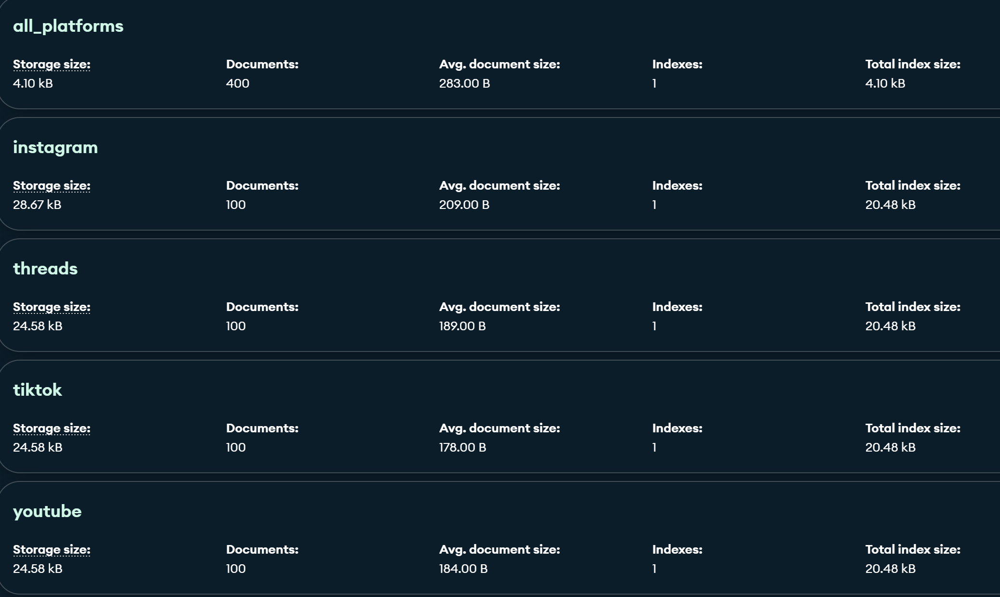
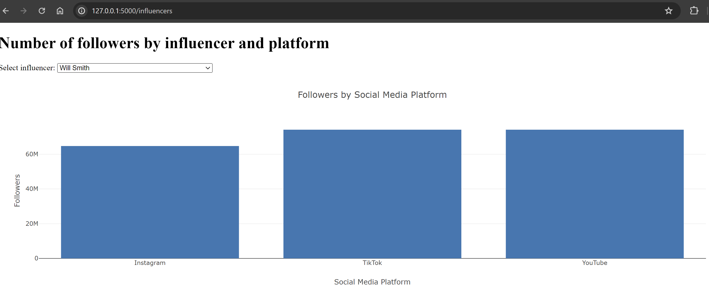
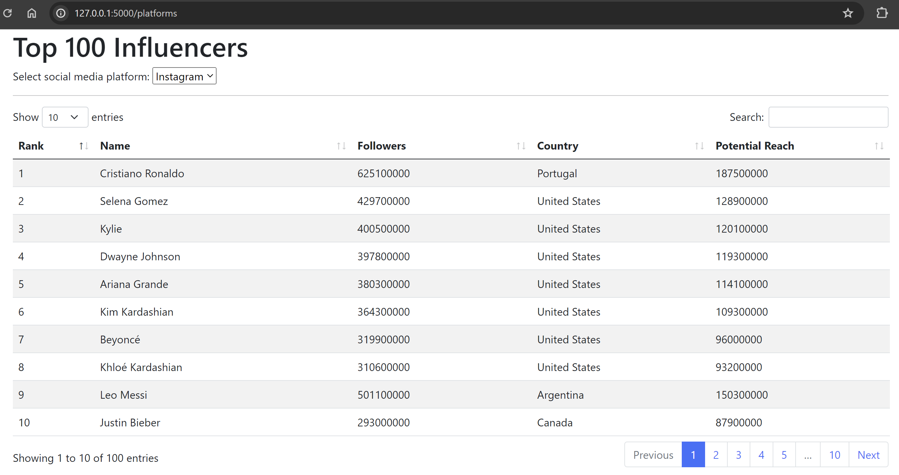
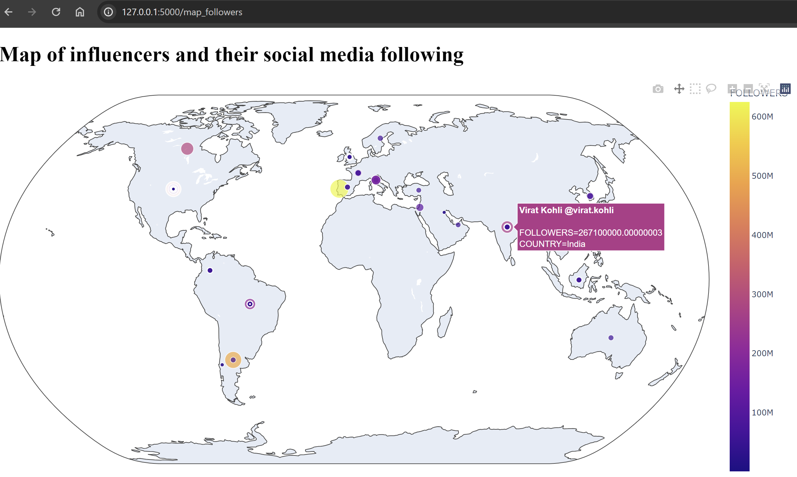
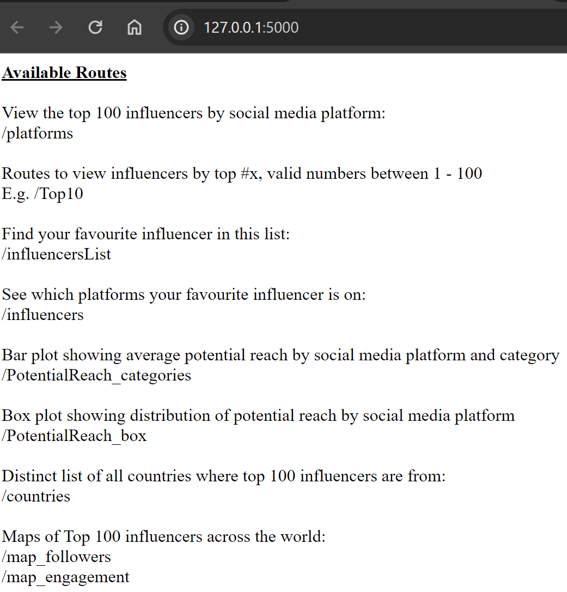

# proj-3-grp-4 - Influencers Data Analysis

## Overview

This repository contains python code for analyzing data from different social media platforms using MongoDB and Python libraries like Pandas and Matplotlib, and html code for visualisation.  

This project creates a web application to visualize data about social media influencers. This includes:  

* Selecting an influencer from a dropdown menu to view bar plot of followers by platform
* Select social media platform from a dropdown menu to see top 100 influencers, their rank, name, followers, country and potential reach. Search by name or country and select how many entries to show on the page.
* Map visualising where influencers are from and engagement rate and followers
* JSON list of countries and influencers
* Bar and box plots analysis potential reach of influencers or social media platform

## Setup

### Importing Data

To import the data into MongoDB, you can use the following commands:

```bash
mongoimport --db='influencers' --collection='instagram' --file=instagram_data_all-countries.csv  --drop --type=csv --headerline  
mongoimport --db='influencers' --collection='threads' --file=threads_data_all-countries.csv  --drop --type=csv --headerline  
mongoimport --db='influencers' --collection='tiktok' --file=tiktok_data_all-countries.csv  --drop --type=csv --headerline  
mongoimport --db='influencers' --collection='youtube' --file=youtube_data_all-countries.csv  --drop --type=csv --headerline
```



### Dependencies

Make sure you have the following Python libraries installed:

* Pandas
* Matplotlib
* Pymongo
* Flask
* Flask_Pymongo
* Seaborn
* BytesIO
* base64

You can install them using pip:

```bash
pip install pandas matplotlib pymongo Flask-PyMongo seaborn
```

### Data Analysis

The jupyter notebook `Analysis.ipynb` and python script `app.py` performs the following operations:

1. Retrieves data from MongoDB collections.
2. Analyses social media influencers on 4 platforms: Instagram, YouTube, Threads and TikTok.
3. Visualizes the data using Matplotlib, Seaborn, Plotly and pandas DataFrame.  
  
  
  

#### Usage

1. Run the Flask server by executing the `app.py` file:

```bash
python app.py
```

1. Open your web browser and go to <http://127.0.0.1:5000/> to access the application (or your local host).
2. Valid routes are listed on the home page.  

3. Navigate through the valid routes and explore influencers on 4 different social media platforms and their engagement, followers and potential reach.

#### Project Structure

```bash
proj-3-grp-4/
│
├── app.py           # Flask application
└── templates/
    └── .html        # HTML templates for rendering pages for visualisations
   ```

### Ethical Considerations

Data was from an open source and does not contain any sensitive or personally identifiable information, ensuring ethical considerations were undertaken.  

Throughout the analysis, we remained vigilant for potential biases. Transparency was prioritized, and efforts were made to clearly document our methodologies.

Our goal was to conduct the analysis in a fair, responsible, and transparent manner, mindful of the potential impact on individuals and communities. We welcome feedback and encourage readers to raise any ethical concerns they may have regarding the project.

### Data source

* "All countries" data of Top 100 Social media influencers of 2024  
<https://www.kaggle.com/datasets/bhavyadhingra00020/top-100-social-media-influencers-2024-countrywise?resource=download->
  
### References

* <https://git.bootcampcontent.com/University-of-Adelaide/UADEL-VIRT-DATA-PT-12-2023-U-LOLC>
* <https://www.mongodb.com/>
* <https://www.python.org/>
* <https://plotly.com/javascript/>
* <https://flask.palletsprojects.com/en/3.0.x/>
* <https://www.sqlalchemy.org/>
* <https://hevodata.com/learn/python-mongodb-connection/>
* <https://www.digitalocean.com/community/tutorials/how-to-use-mongodb-in-a-flask-application>
* <https://www.geeksforgeeks.org/sending-data-from-a-flask-app-to-mongodb-database/>
* <https://stackoverflow.com/questions/65419083/simple-matplotlib-as-embedded-image-in-web-page-generated-by-flask>
